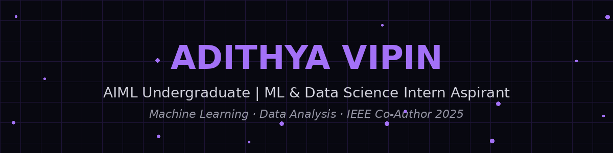

 

## 🔥 Featured Projects

<table width="100%">
<tr>
<td width="50%" valign="top">
 

**◆ F1 Pit-Stop Strategy Optimizer**

ML-based simulation optimizing F1 pit-stop strategies using tyre degradation modeling and Monte Carlo analysis.

`Python` `Monte Carlo` `Optimization`

 
</td>
<td width="50%" valign="top">
 

**▣ Smart Drone Crop Disease Detection**

UAV + IoT + Edge AI pipeline with YOLOv8 (TensorRT INT8) on Jetson, fused with climate risk modeling.

`YOLOv8` `Jetson` `XGBoost`

 
</td>
</tr>
<tr>
<td width="50%" valign="top">
 

**◈ Autonomous Vehicle RL Simulation**

CARLA-based driving sim with custom PPO environment — 87% collision reduction, 5.4× reward improvement.

`CARLA` `PPO` `Reinforcement Learning`

 
</td>
<td width="50%" valign="top">
 

**▶ Plagiarism Detection RPA Bot**

End-to-end UiPath pipeline integrating Copyleaks API, automated scoring & email notifications.

`UiPath` `RPA` `API Integration`

 
</td>
</tr>
</table>

 

## 📄 Research & Publications

> **CUDA-Accelerated Student Performance Prediction Using Deep Neural Networks**
> *IEEE Conference, 2025 — Under Review · Co-Author*
>
> Proposed **AdvancedStudentNet** — 88.44% accuracy · F1-Score 0.924 · 15.4× GPU inference speedup at 1M predictions

 

## 🛠️ Tech Stack

 

 

## 📊 GitHub Stats

 

### 🤝 Connect

 

