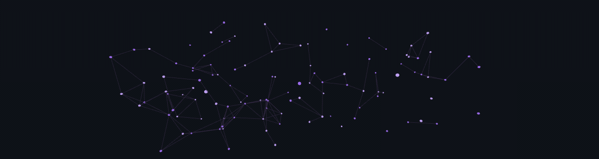

 

 

Machine Learning & Data Science undergraduate with hands-on experience across computer vision, deep learning, and LLM-based systems. Proficient in Python, TensorFlow, PyTorch, and Scikit-learn, with a peer-reviewed research submission and multiple end-to-end ML projects deployed as working applications.

 

## 🧪 Currently Building

**HIL-Drive — Human–AI Driving & Control Research Platform** · *In progress, 2026*
 Building a hardware-in-the-loop driving rig to capture real steering, throttle, and braking data from human drivers, and designing a shared-autonomy system that blends human and AI control based on real-time risk.

 

## 💼 Experience

<table width="100%">
<tr>
<td width="50%" valign="top">
 

**Data Science & AI Intern**
 *IIT Jammu (via Techible & I3C)* · Jun – Aug 2026

- Delivered a credit card fraud anomaly detector and an algorithmic trading strategy backtester as program deliverables

 
</td>
<td width="50%" valign="top">
 

**Data Science Intern**
 *Finlatics* · Jul – Sep 2025

- Applied Python and statistical techniques across data analysis projects
- Delivered an EDA project scored 90/100, translating business objectives into data-driven insights

 
</td>
</tr>
</table>

 

## 🔥 Featured Projects

<table width="100%">
<tr>
<td width="50%" valign="top">
 

**◆ F1 Pit-Stop Strategy Optimizer**

ML simulation optimizing Formula 1 pit-stop strategy against tyre wear and compound choice — one- vs. two-stop strategies compared via Monte Carlo simulation and a real-time decision engine.

`Python` `Monte Carlo` `Optimization`

 
</td>
<td width="50%" valign="top">
 

**▣ Autonomous Research Agent**

Full-stack LLM research agent (FastAPI + Next.js) that searches arXiv/Semantic Scholar with an LLM router, memory, and scheduled search — tested with a 13-file pytest suite.

`FastAPI` `Next.js` `LLM Agents`

 
</td>
</tr>
<tr>
<td width="50%" valign="top">
 

**◈ Autonomous Vehicle RL Simulation**

CARLA-based driving sim with a custom PPO environment — cut collisions by 87% and improved average reward 5.4× through reward shaping and tuning.

`CARLA` `PPO` `Reinforcement Learning`

 
</td>
<td width="50%" valign="top">
 

**▶ Wingman — AI Assistant Platform**

Hackathon project rebuilt solo onto local Ollama models with a single chat interface — Planner, Travel, Reminder, and Document agents with RAG-based Q&A.

`FastAPI` `Ollama` `RAG`

 
</td>
</tr>
</table>

 

## 📄 Research & Publications

> **CUDA-Accelerated Student Performance Prediction Using Deep Neural Networks**
> *IEEE Conference Submission, 2026 — Under Review · Co-Author · Guided by Prof. Spoorthi GS*
>
> Proposed **AdvancedStudentNet** — CUDA-accelerated deep neural network with SMOTE augmentation achieving 88.44% accuracy, F1-Score 0.924, and 15.4× GPU inference speedup at 1M predictions on the Cortez & Silva Student Performance Dataset.

 

## 📜 Certifications

- Google Cloud Career Launchpad — Generative AI *(Feb 2026)*
- UiPath Academy Automation Developer Associate *(Mar 2026)*
- UiPath Academy Automation Explorer Training *(Mar 2026)*
- Nutanix Certified Associate 6 *(Apr 2025)*
- Oracle Cloud Infrastructure AI Foundations *(Sep 2025)*
- Data Science with Python, Machine Learning — Finlatics *(Sep 2025)*
- Data Analytics — Google Skillshop *(Mar – May 2025)*

 

## 🛠️ Tech Stack

 

 

 

 

## 📊 GitHub Stats

 

<!-- activates after the "Generate contribution snake" Action runs once — see setup notes -->

 

### 🤝 Connect

 

